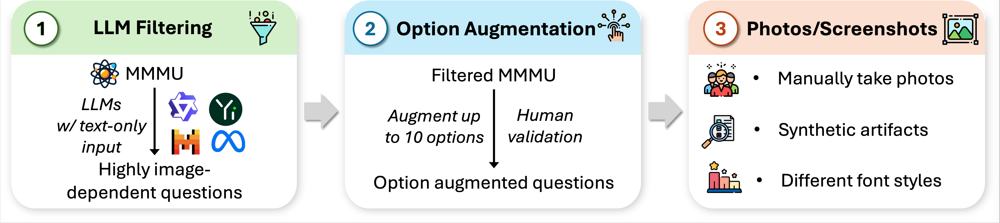

# MMMU-Pro Benchmark

## Introduction

Building upon MMMU, MMMU-Pro introduces even more stringent assessment methodologies to evaluate multimodal models' intrinsic understanding and reasoning capabilities. MMMU-Pro employs a meticulously structured three-step process:

1. **Filtering out text-only answerable questions**: Ensures that the questions pressing multimodal understanding rather than purely textual comprehension.
2. **Augmenting candidate options**: Introduces additional plausible options to make the task more challenging.
3. **Vision-only input setting**: Embedding questions within images pushes AI to "see" and "read" simultaneously, replicating a core human cognitive skill of integrating visual and textual information.

Our results reveal that model performance on MMMU-Pro is significantly lower than on MMMU, with accuracies ranging from 16.8% to 26.9% across various models. We investigate the effects of OCR prompts and Chain of Thought (CoT) reasoning. OCR prompts have minimal impact, while CoT generally enhances performance. MMMU-Pro offers a more rigorous evaluation framework, closely reflecting real-world scenarios and providing critical insights for advancing multimodal AI research.

## Dataset Creation

MMMU-Pro were meticulously designed to challenge and evaluate multimodal models with tasks demanding college-level subject knowledge and complex reasoning. 
